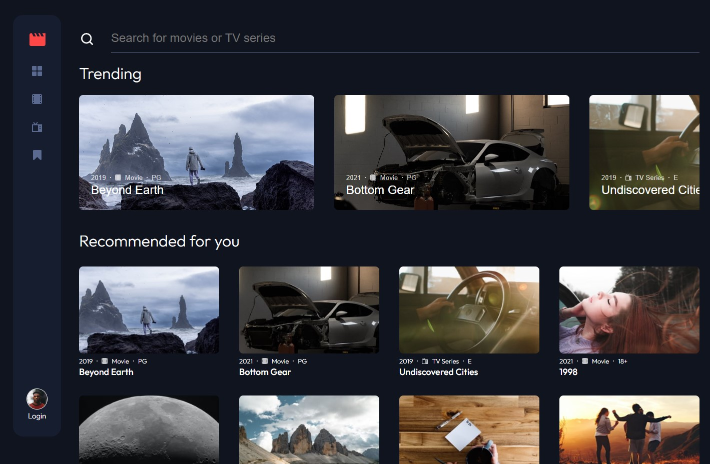

# Frontend Mentor - Entertainment web app solution

This is a solution to the [Entertainment web app challenge on Frontend Mentor](https://www.frontendmentor.io/challenges/entertainment-web-app-J-UhgAW1X). Frontend Mentor challenges help you improve your coding skills by building realistic project.

## Table of contents

- [Overview](#overview)
  - [The challenge](#the-challenge)
  - [Screenshot](#screenshot)
  - [Links](#links)
- [My process](#my-process)
  - [Built with](#built-with)
  - [What I learned](#what-i-learned)
- [Author](#author)

**Note: Delete this note and update the table of contents based on what sections you keep.**

## Overview

### The challenge

Users should be able to:

- View the optimal layout for the app depending on their device's screen size
- See hover states for all interactive elements on the page
- Navigate between Home, Movies, TV Series, and Bookmarked Shows pages
- Add/Remove bookmarks from all movies and TV series
- Search for relevant shows on all pages
- **Bonus**: Build this project as a full-stack application
- **Bonus**: If you're building a full-stack app, we provide authentication screen (sign-up/login) designs if you'd like to create an auth flow

### Screenshot



### Links

- Solution URL: [https://github.com/animalchin45/Entertainment-Web-App]
- Live Site URL: [https://entertainment-web-app-zr1s.onrender.com/]

## My process

### Built with

- Semantic HTML5 markup
- CSS custom properties
- Flexbox
- CSS Grid
- Axios
- Webpack
- Sass / Scss
- React Hook Form
- Redux Toolkit
- [React](https://reactjs.org/) - JS library
- [Node](https://nodejs.org/)
- [MongoDB](https://www.mongodb.com/)
- [Render](https://www.render.com)

### What I learned

This is challenge that will put your full stack skills to the test. I made a couple small changes to the design to more completly accomadate an auth flow. The avatar need some kind of user feedback to show that someone is logged in. I setup the bookmarks so that they are only available when a user is present and they are persistant with the user that is logged in. I've made a similar project outside of this challenge using a third party API for images and text. This was a learning experience as this challenge simply has a JSON file and local assets. I had to change my method for importing a large number of images dynamically.

This is the custom hook for importing all images

```js
function importAll(r) {
  let images = {}
  r.keys().map((item, index) => {
    images[item.replace('./', '')] = r(item)
  })
  return images
}

export const images = importAll(
  require.context('../assets', true, /\.(png|jpe?g|svg)$/)
)
```

Then the base image path can be set in the map method for rendering the show grid. The imgSrc can now be set dynamically as each card is rendered.

````js
const imgPath = title.thumbnail.regular.small
const imgSrc = images[imgPath.replace('./assets/', '')]
```

## Author

- Website - [Tim O'Brien](https://timobrien.dev)
- Frontend Mentor - [@animalchin45](https://www.frontendmentor.io/profile/animalchin45)
````
